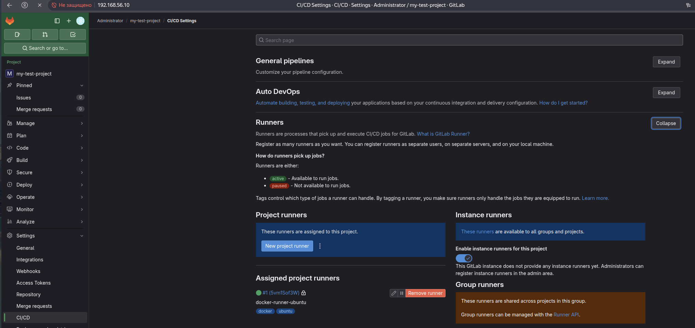
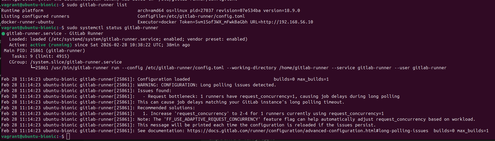
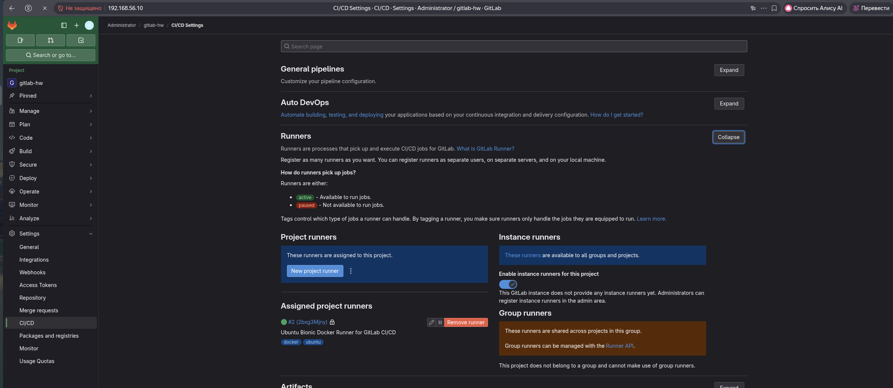
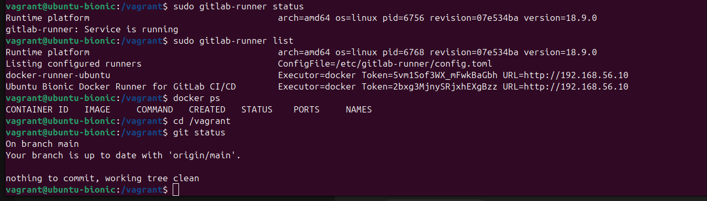
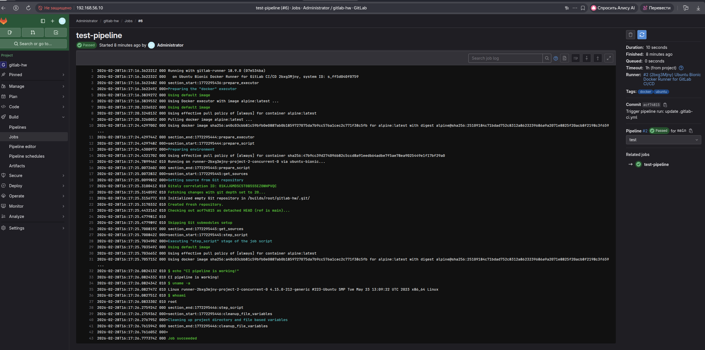

# Домашнее задание к занятию «GitLab»
# Чехлов Михаил

## Задание 1

*Статус раннера — active (зелёная точка), теги docker, ubuntu.*

*Раннер зарегистрирован с ID #1 (5vm1Sof3W).*

## Задание 2

*Статус раннера — active (зелёная точка), теги docker, ubuntu.*

*Раннер зарегистрирован с ID #2 (2bxg3Mjny).*

*Вывод команд echo, uname -a, whoami.*

Pipelines "gitlab-ci.yml".

test-docker:
  tags:
    - docker
  script:
    - echo "Running in Docker container!"
    - docker --version
    - uname -a
    - whoami
